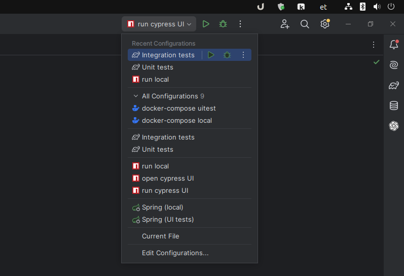
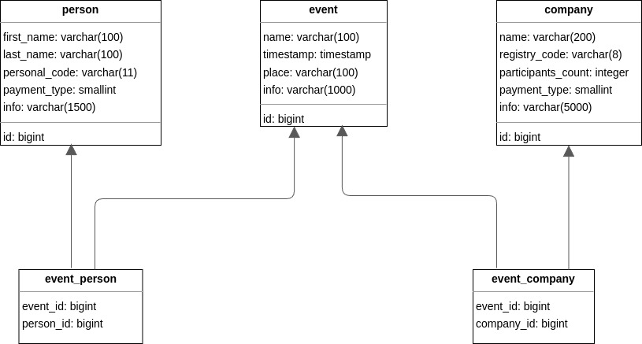

# RIK prooviülesanne

## Käivitamine
### Lokaalne käivitamine

1) Instaleerige ja käivitage [Docker](https://docs.docker.com/get-docker/)
2) Avage projekt Intellij IDEA's
3) Avage IntelliJ IDEA Run configurations ja käivitage "docker-compose local"
4) Pärast Dockeri seadistamise protsessi lõppu avage [see](http://localhost:5173/) leht brauseris

### UI testide käivitamine
1) Instaleerige ja käivitage [Docker](https://docs.docker.com/get-docker/)
2) Avage projekt Intellij IDEA's
3) Käivitage [run-uitest.sh](run-uitest.sh), või avage IntelliJ Run configurations 
   ja käivitage "docker-compose uitest". Pärast Dockeri seadistamise protsessi lõppu valige "run cypress UI" Run configuration.

### Integratsiooni testide käivitamine
1) Avage projekt Intellij IDEA's
2) Avage IntelliJ Run configurations ja käivitage "Integration tests"

### Unit testid käivitamine
1) Avage projekt Intellij IDEA's
2) Avage IntelliJ Run configurations ja käivitage "Unit tests"

## Projekti arhitektuur
### Andmebaasi skeem (ERD)

### Projekti skeem
