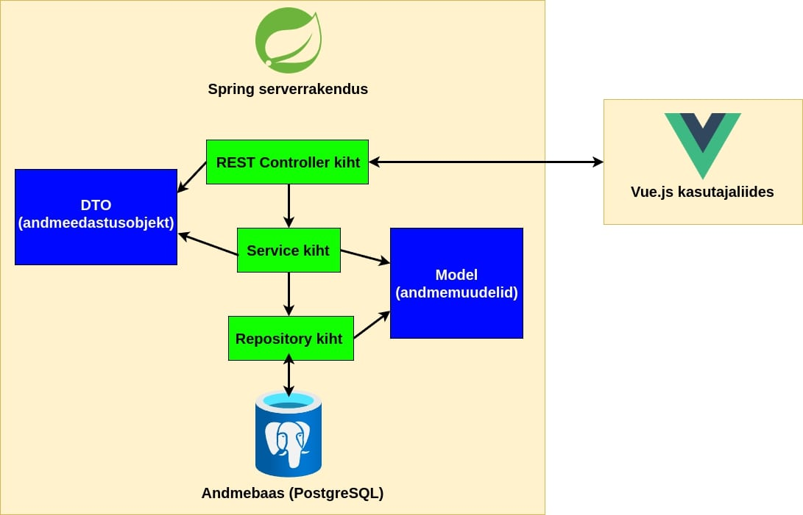

# RIK prooviülesanne

## Stack
#### Serverrakendus: ```Spring Boot (JPA, Web, Validation), Lombok, Testcontainers```
#### Kasutajaliides: ```Vue 3, Vite, Bootstrap, Vuelidate```
#### Andmebaas: ```PostgreSQL```
#### UI testid: ```Cypress```

## Käivitamine

1) Installige Java 21 (IntelliJ -> File -> Project Structure -> Download JDK -> Oracle OpenJDK 21)
2) Installige [Node.js 18](https://nodejs.org/en/blog/release/v18.12.0) (IntelliJ -> Settings -> Language & Frameworks -> Node.js -> valige nodejs.exe)
3) Avage terminalis kausta "frontend" ja käivitage "npm install"
4) Installige ja käivitage [Docker Desktop](https://docs.docker.com/get-docker/)

### Lokaalne käivitamine

1) Käivitage [run-app.sh](run-app.sh), <b>või</b> avage terminal ja käivitage "docker compose down", 
paremklõpsake IntelliJ'is [docker-compose.yml](docker-compose.yml) faili peal, ja valige "Run"
2) Pärast Dockeri seadistamise protsessi lõppu avage [see](http://localhost:5173/) leht brauseris

### UI testide käivitamine
1) Käivitage [run-uitest.sh](run-uitest.sh) <b>või</b> avage terminal ja käivitage "docker compose down", 
paremklõpsake IntelliJ'is [docker-compose-uitest.yml](docker-compose-uitest.yml) faili peal ja valige "Run"
2) Pärast Dockeri seadistamise protsessi lõppu avage terminalis kausta "frontend" ja käivitage "npm run run:cypress"

### Integratsiooni testide käivitamine
Avage backend/src/intTest. Paremklõpsake kausta peal ja vajutage "Run".

### Unit testide käivitamine
Avage backend/src/test. Paremklõpsake kausta peal ja vajutage "Run".

## Rakenduse arhitektuur
### Andmebaasi skeem (ERD)

### Kihtide skeem
